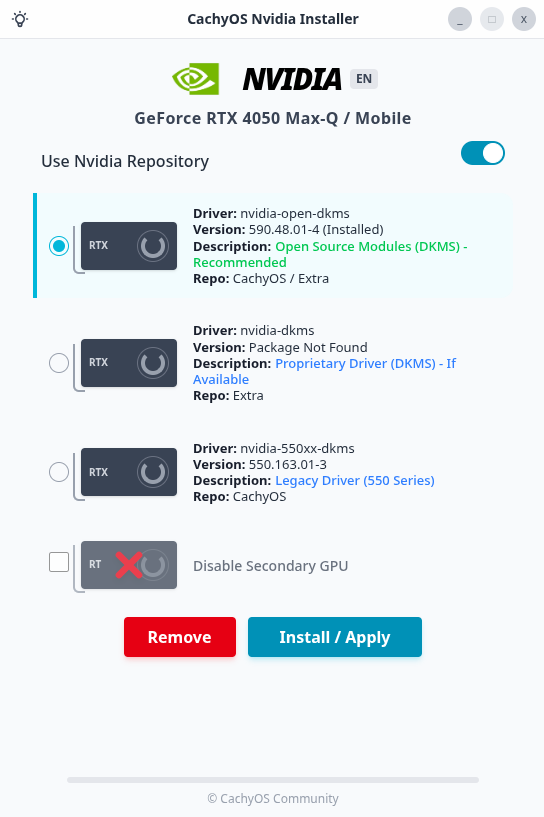

# CachyOS Nvidia Installer

A modern, user-friendly GUI application developed for CachyOS to simplify the installation and management of NVIDIA drivers.



## Features

- **Automatic GPU Detection**: Instantly identifies your NVIDIA GPU model using `lspci`.
- **Smart Driver Detection**: Automatically detects installed CachyOS driver packages (e.g., `linux-cachyos-nvidia-open`).
- **Driver Management**:
  - **nvidia-open-dkms**: Open-source kernel modules (Recommended / Default).
  - **nvidia-dkms**: Proprietary driver (if available).
  - **nvidia-550xx-dkms**: Legacy support for older cards.
- **One-Click Actions**: Easily **Install** or **Remove** drivers via the GUI.
- **Modern UI**: Clean, responsive interface built with React and TailwindCSS.
- **Internationalization (i18n)**: 
  - Full support for **Turkish** and **English**.
  - Automatic language detection based on system preferences.
  - Manual language toggle support.
- **Robustness**: 
  - Improved API connection with auto-retry mechanism.
  - Safe GPU detection (locale-independent Regex logic).
- **Dark Mode**: Fully supported dark/light themes with persistence.

## Tech Stack

- **Electron**: Desktop runtime.
- **Vite**: Fast build tool and dev server.
- **React**: UI library.
- **TailwindCSS**: Styling.
- **TypeScript**: Type safety for both Main and Renderer processes.

## Development

### Prerequisites

- Node.js (v18+)
- npm or pnpm

### Setup

1.  Clone the repository:
    ```bash
    git clone https://github.com/topalemirfaruk/CachyOS-Nvidia-Installer.git
    cd CachyOS-Nvidia-Installer
    ```

2.  Install dependencies:
    ```bash
    npm install
    ```

3.  Run in development mode:
    ```bash
    npm run dev
    ```

## Build

To create a production build (distributable):

```bash
npm run build
```

## License

MIT License
